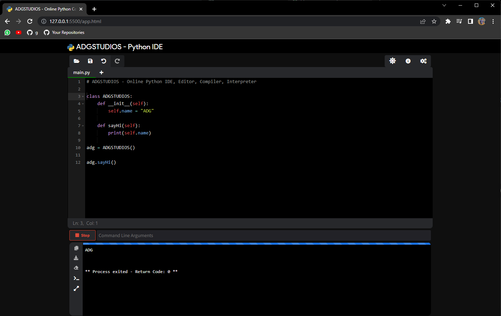

# ADGSTUDIOS - Python IDE

This IDE is a web-based tool powered by `ACE code editor`. This tool can be used to learn, build, run, test your python script. You can open the script from your localhost system and continue to build using this IDE. Code and output can be downloaded to localhost.

to run this app just run this folder on any generic web server like `nginx` or `apache` alternatively just open the `app.html` in any web browser.

This is a tool @ ADGSTUDIOS as a lab for playing around with 
python.

### made with ❤️ by [ADGSTUDIOS](https://adgstudios.com)